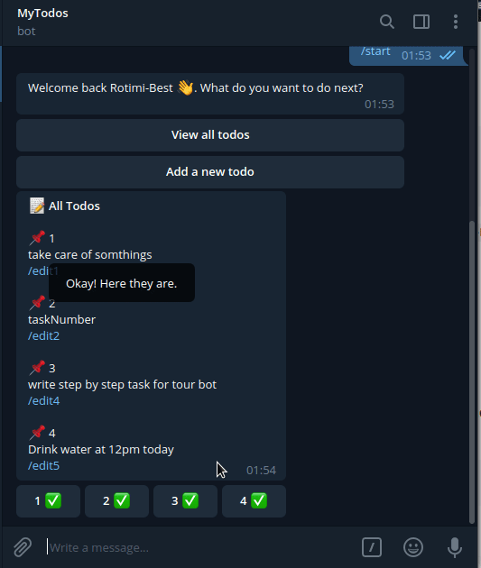

# mytodos
A Nodejs telegram bot for creating and managing todos, using .

# Installation
- `git clone https://github.com/Rotimi-Best/mytodos.git`
- `npm install `
- Create a .env file and place an API_KEY in your there if not you would see errors 
- `npm start`

# Functionalities
- **/mytodos** - all your pending tasks
- **/newtodo** - add a task to your todolist
- **/donetodos** - all done or completed todos

Some extra ones are:
- Mark as completed - This is a green check button beneath the list
- Delete completed tasks - This apears beneath the list of done tasks using /donetodos command
- Edit a task - Beneath each todo there is a /edittodo<unique_task_number>, once clicked allows you to edit your todo
- Copy a task to clipboard - Beside the /edittodo command is a /copytodo<unique_task_number>, once clicked you can paste that task anywhere.

# Demo
**How to edit a task:**

